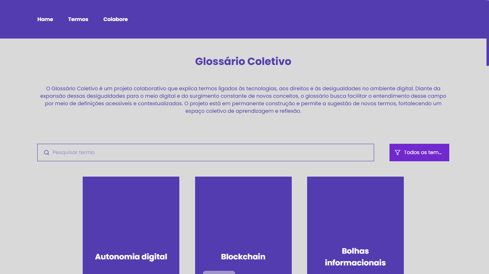

## 📖 Glossário Coletivo

O **Glossário Coletivo** é uma iniciativa colaborativa que reúne e explica termos relacionados a tecnologias, direitos e desigualdades no meio digital, com foco em acessibilidade, linguagem clara e participação coletiva.

O projeto busca facilitar o entendimento de conceitos que emergem no universo digital e que impactam diretamente a vida social, política e cultural, especialmente em contextos de desigualdade.

## ✨ Funcionalidades

- 📚 Listagem de termos em formato de cards interativos
- 🔄 Cards com efeito de flip para visualização da definição
- 🔎 Busca por termo
- 🏷️ Filtro por categorias temáticas
- ➕ Carregamento progressivo dos termos
- 📝 Formulário para sugestão de novos termos
- 📩 Armazenamento das sugestões via Netlify Forms
- 🎉 Página de confirmação após envio do formulário
- 📱 Layout responsivo

## 🛠️ Tecnologias utilizadas

- React
- Vite
- Styled-components
- React Icons
- React Markdown
- Netlify

## 🚀 Acesso ao projeto

🔗 https://glossario-coletivo.netlify.app

> Esta ação é fruto das atividades de mentoria do projeto **“Tramas Digitais – Tecendo Futuros”**, iniciativa do **Olabi** que busca diversificar o campo dos direitos digitais no Brasil.

---

Feito com 💜 por **Madalena Rocha**

  
  
  
  

